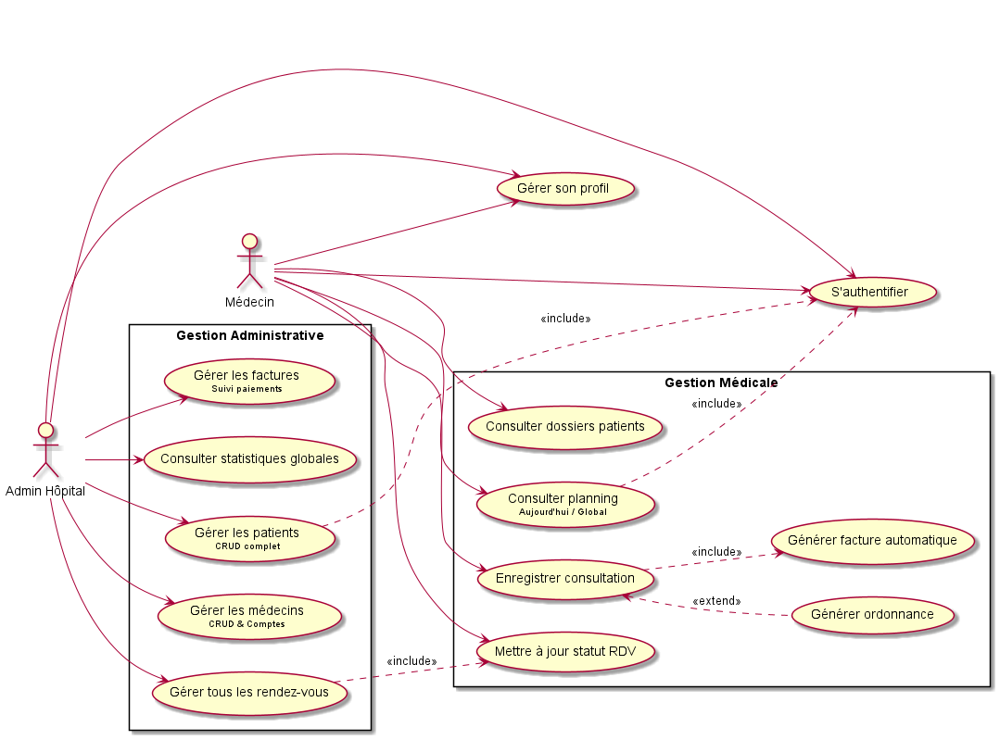
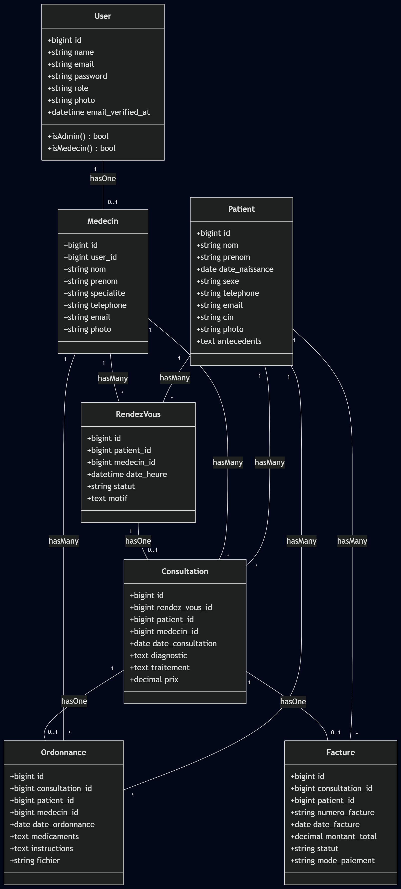
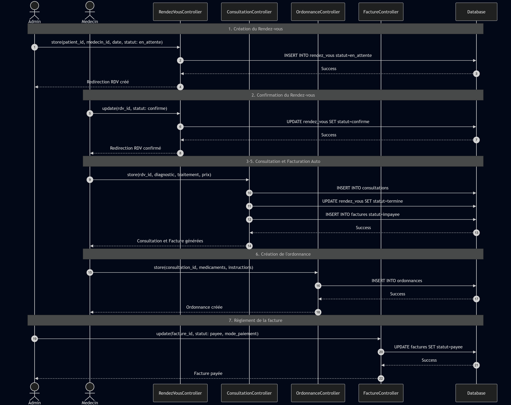

<div align="center">

```
███╗   ███╗███████╗██████╗ ██╗ ██████╗ ██████╗ ██████╗ ███████╗
████╗ ████║██╔════╝██╔══██╗██║██╔════╝██╔═══██╗██╔══██╗██╔════╝
██╔████╔██║█████╗  ██║  ██║██║██║     ██║   ██║██████╔╝█████╗
██║╚██╔╝██║██╔══╝  ██║  ██║██║██║     ██║   ██║██╔══██╗██╔══╝
██║ ╚═╝ ██║███████╗██████╔╝██║╚██████╗╚██████╔╝██║  ██║███████╗
╚═╝     ╚═╝╚══════╝╚═════╝ ╚═╝ ╚═════╝ ╚═════╝ ╚═╝  ╚═╝╚══════╝
                          N O V A  ·  2 0 2 6
```

**Enterprise Hospital Solution — Intelligence Artificielle · Cybersécurité · Décisionnel**

---

[](https://laravel.com)
[](https://react.dev)
[](https://php.net)
[](https://tailwindcss.com)
[](https://chartjs.org)
[](https://mysql.com)
[](https://groq.com)
[]()

</div>

---

## 📑 Sommaire

| #   | Section                                                           |
| --- | ----------------------------------------------------------------- |
| 💎  | [Joyaux Techniques](#-joyaux-techniques)                          |
| 🎨  | [Fonctionnalités Phares](#-fonctionnalités-phares)                |
| 📐  | [Conception & Modélisation UML](#-conception--modélisation-uml)   |
| 🛠️  | [Stack Technique & Architecture](#️-stack-technique--architecture) |
| 🚀  | [Installation & Démarrage](#-installation--démarrage)             |
| 👤  | [Comptes de Test](#-comptes-de-test-démo)                         |

---

## 💎 Joyaux Techniques

> Trois innovations au cœur de MediCore Nova, conçues pour répondre aux défis critiques du management hospitalier.

<table>
<tr>
<td width="33%" valign="top">

### 🤖 `01` — IA Clinique

**Assistant E-Prescription**

Propulsé par **Groq Llama 3**, le médecin saisit ses notes en langage naturel. L'IA :

- Structure le diagnostic automatiquement
- Rédige l'ordonnance clinique
- Génère un **PDF sécurisé** via DomPDF

</td>
<td width="33%" valign="top">

### 🔒 `02` — QR Expirable

**Cybersécurité Documentaire**

Token cryptographique temporel embarqué dans chaque PDF :

- ✅ **< 6h** → Portail React · Émeraude
- ❌ **> 6h** → Auto-destruction · Alerte rouge
- Hébergé sur **GitHub Pages**

</td>
<td width="33%" valign="top">

### 📊 `03` — Dashboards

**Décisionnel Temps Réel**

Analyses Chart.js interactives :

- Praticien : activité, RDV, volumes
- Admin : revenus (DH), spécialités
- Taux de fréquentation global

</td>
</tr>
</table>

---

## 🎨 Fonctionnalités Phares

<details>
<summary><b>🏛️ Administration Centrale</b></summary>

<br>

| Module                     | Description                                                             |
| -------------------------- | ----------------------------------------------------------------------- |
| 📈 **Dashboard Global**    | Monitorer les flux financiers, médicaux et administratifs en temps réel |
| 👨‍⚕️ **Gestion Praticiens**  | Recrutement, attribution des spécialités, gestion des plannings         |
| 🗂️ **Annuaire Patients**   | Centralisation des dossiers informatisés de santé                       |
| 💰 **Rapports Financiers** | Évolution des revenus mensuels, indicateurs de performance              |

</details>

<details>
<summary><b>👩‍⚕️ Espace Praticien (Médecin)</b></summary>

<br>

| Module                        | Description                                                            |
| ----------------------------- | ---------------------------------------------------------------------- |
| 📅 **Planning du jour**       | Liste ordonnée des consultations et alertes d'urgences                 |
| 📋 **Dossier Patient Unique** | Accès instantané aux antécédents, allergies, consultations précédentes |
| 🤖 **E-Prescription IA**      | Rédaction assistée Llama 3, PDF sécurisé + QR code cryptographique     |
| 💳 **Module Facturation**     | Génération des récapitulatifs financiers par consultation              |

</details>

---

## 📐 Conception & Modélisation UML

<table>
<tr>
<td align="center" width="33%">

**🎯 Use Case**

_Interactions Admin · Médecin · Patient_



</td>
<td align="center" width="33%">

**🗂️ Diagramme de Classes**

_ORM Eloquent · Structure relationnelle_



</td>
<td align="center" width="33%">

**⏱️ Diagramme de Séquence**

_Cycle de vie consultation & RDV_



</td>
</tr>
</table>

---

## 🛠️ Stack Technique & Architecture

<table>
<tr>
<td width="50%" valign="top">

#### 🖥️ Backend & Système

| Technologie               | Rôle                                      |
| ------------------------- | ----------------------------------------- |
| **Laravel 12** · PHP 8.2+ | Architecture MVC, sécurité, ORM Eloquent  |
| **Groq Llama 3**          | IA générative pour l'assistance clinique  |
| **DomPDF**                | Génération des ordonnances PDF sécurisées |
| **Simple QRCode** (SVG)   | Token cryptographique vectoriel 6h        |
| **MySQL / SQLite**        | Stockage relationnel structuré            |

</td>
<td width="50%" valign="top">

#### 🎨 Frontend & Interaction

| Technologie             | Rôle                                      |
| ----------------------- | ----------------------------------------- |
| **React 18** · Vite     | Portail de vérification QR (GitHub Pages) |
| **Tailwind CSS 3**      | UI du portail React, responsive           |
| **Blade** · Vanilla CSS | Nova Theme — interface principale Laravel |
| **Chart.js 4**          | Dashboards décisionnels interactifs       |

</td>
</tr>
</table>

```
┌─────────────────────────────────────────────────────────┐
│                    MediCore Nova                        │
│                                                         │
│  ┌──────────────┐        ┌──────────────────────────┐  │
│  │  Laravel 12  │◄──────►│     React (Vite)         │  │
│  │  Backend MVC │        │  Portail QR · GitHub Pages│  │
│  └──────┬───────┘        └──────────────────────────┘  │
│         │                                               │
│  ┌──────▼───────┐        ┌──────────────────────────┐  │
│  │    MySQL     │        │      Groq Llama 3        │  │
│  │   Database   │        │     AI Prescription      │  │
│  └──────────────┘        └──────────────────────────┘  │
└─────────────────────────────────────────────────────────┘
```

---

## 🚀 Installation & Démarrage

### Pré-requis

```
PHP >= 8.2    Composer    Node.js & NPM
```

### Étape 1 — Clone & Dépendances

```bash
git clone https://github.com/Amine-NAHLI/hopital-app.git
cd hopital-app
composer install && npm install
```

### Étape 2 — Environnement & Clé

```bash
cp .env.example .env
php artisan key:generate
```

> [!IMPORTANT]
> Configurez dans votre `.env` :
>
> - `GROQ_API_KEY` → active l'assistant IA
> - `TUNNEL_URL` → pointe vers le portail React de confirmation QR

### Étape 3 — Base de Données

```bash
php artisan migrate --seed
```

### Étape 4 — Lancement

```bash
# Terminal 1 — Serveur Laravel
php artisan serve

# Terminal 2 — Compilation assets
npm run dev
```

> [!TIP]
> L'application sera disponible sur `http://localhost:8000`

---

## 👤 Comptes de Test (Démo)

<table>
<tr>
<td width="50%">

### 🛡️ Administrateur

```
Email    : admin@hopital.com
Password : password
```

Accès complet aux dashboards financiers, gestion des praticiens et annuaire patients.

</td>
<td width="50%">

### 👩‍⚕️ Dr. Karim Bennani

```
Email    : medecin@hopital.com
Password : password
```

Accès au planning, DPU, e-prescription IA et module de facturation.

</td>
</tr>
</table>

---

<div align="center">

```
╔═══════════════════════════════════════════════╗
║   Propulsé par la rigueur scientifique        ║
║          et l'innovation                      ║
║                                               ║
║         MediCore Nova  ©  2026                ║
╚═══════════════════════════════════════════════╝
```

[](https://github.com/Amine-NAHLI/hopital-app)

</div>
